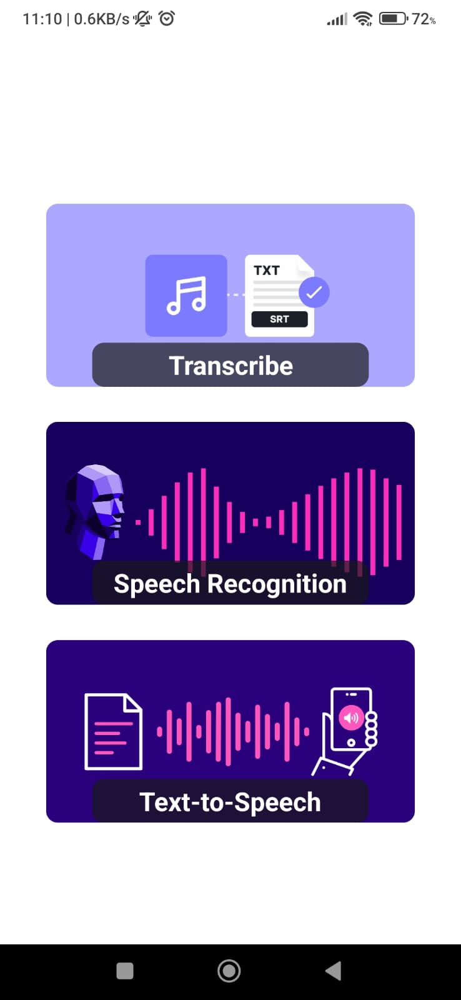
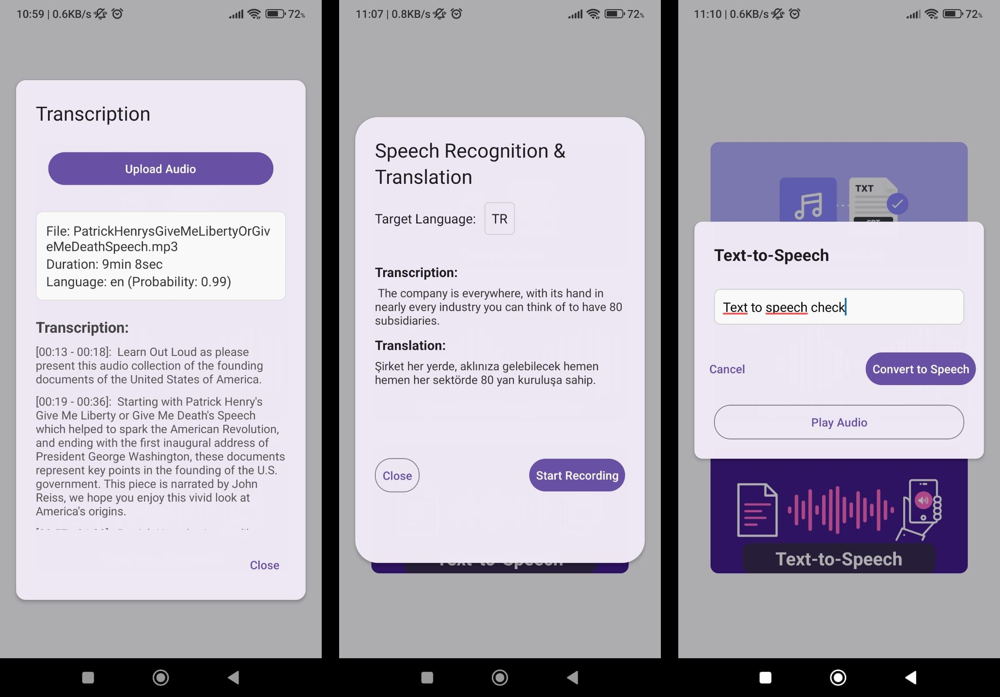

# Speech Processing Mobile App

This project is designed to provide efficient audio transcription, text-to-speech (TTS), speech recognition and translation through a Dockerized API, using gTTS, Faster-Whisper model and FastAPI. It also includes a mobile app built with React Native as an example implementation.

## Features

- Transcription, Speech Recognition and Translation using Faster-Whisper
- Text-to-Speech with gTTS and langid
- Dockerized API
- React Native Expo App
  
## Requirements

- Docker Engine
- CUDA supported hardware
- npm and expo (for mobile app)

## Setup

### Backend (Docker)
To run the FastAPI in a Docker container:
1. Navigate to the docker/ folder and build the Docker image (can take some time):

   ```bash
   cd docker
   docker build -t speech-proccesing-api .
   ```

2. Run the Docker container:

    ```bash
    docker run --gpus all -p 8000:8000 speech-proccesing-api
    ```
Wait for microservice to initialize, it can take a few minutes. FYI, you can check the container's logs within Docker Desktop to supervise the process.
     
3. Access the API:
   Open your browser and go to http://localhost:8000/ to view the API Documentation(SwaggerUI).

### Mobile App (expo)   

1. Navigate to the mobile-app/ folder and install the dependencies:
   ```bash
   cd mobile-app
   npx expo install
   ```

2. Connect the Dockerized API:
   Navigate to the app.json file and modify the API_URL to your network's IP. (E.g. container can take the IP of the connected Wifi by default, which mobile device should be connected too, in development.)
   
3. Run the app:
  ```bash
   npx expo start
   ```
You can open the app with expo app on Android, or camera app on iOS. Home screen is given below:

<div align="center">
  
</div>

## Usage
Once both the backend and mobile app are running, you can interact with the mobile app to:
- Transcribe audio files with timestamps
- Record speech for transcription and translation
- Convert text into speech
  
Response time can vary depending on the system, particulary GPU.



## Contributing
Feel free to open issues or submit pull requests for improvements.
